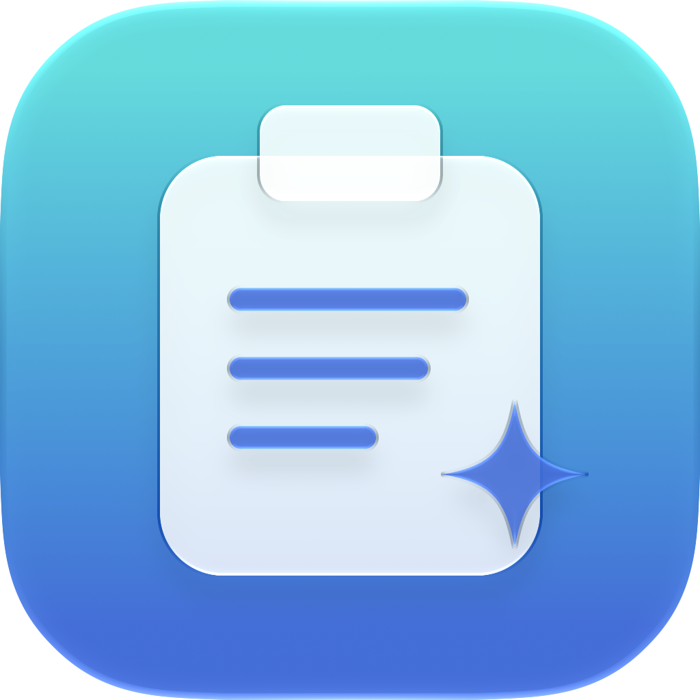

# ClearPaste



**Plain text, on command.** A small native macOS menu bar utility.

| Shortcut | Behavior |
| --- | --- |
| **⌘C** | Copy normally, including formatting. |
| **⌘V** | Paste normally. |
| **⌥⌘V** | Paste the copied text without formatting. |

ClearPaste never automatically strips copied text. It temporarily supplies plain text for Option-Command-V, sends a normal paste keystroke to the frontmost app, then restores the original clipboard if you haven't copied something else.

## Build and run

Requires macOS 26 or later (including macOS 27) and an SDK supporting Liquid Glass, such as Xcode 26 or newer. The current local build uses the macOS 27 SDK. No third-party packages.

```sh
./scripts/build-app.sh
open dist/ClearPaste.app
```

Look for the clipboard icon in the menu bar. Open **Settings → Enable Accessibility…**, then allow ClearPaste in **System Settings → Privacy & Security → Accessibility**. This permission lets ClearPaste send the paste keystroke. Copy and normal paste work without that permission; the plain-text shortcut needs it.

For regular use, copy `dist/ClearPaste.app` to Applications before granting permission and enabling **Launch at login**. Rebuilding an ad hoc signed app can require reauthorizing Accessibility. Builds are locally signed, not notarized for public distribution.

## Features

- Global Option-Command-V shortcut, with registration errors shown in the menu.
- Temporary plain-text clipboard with restoration after paste.
- Common URL tracking removal (`utm_*` and common click identifiers).
- Optional invisible-space removal, straight quotes, footnote removal, and newline cleanup.
- Launch at login and native light/dark settings.
- No automatic copy transformation, clipboard history, analytics, or network requests.

## Faster paste and heading replacements

The shortcut fires once on **key release** and waits for physical modifier keys to lift before sending paste or typing. This avoids the regression caused by delivering synthetic input while Option and Command were still physically held. Paste events also carry explicit modifier flags. Clipboard restoration runs separately, so the next shortcut is no longer blocked by the 800 ms restoration window. Holding the shortcut does not repeat the paste.

For Word Online headings, try **Settings → Preserve the current text style → Type short text instead of pasting**. This optional mode delivers Unicode text as typing instead of invoking Word's paste handling. It leaves the clipboard untouched and gives the editor an opportunity to preserve its current style when replacing the whole heading. It is off by default.

[Microsoft documents](https://learn.microsoft.com/en-us/office365/servicedescriptions/office-online-service-description/word-online) that Word for the web supports Paste Text Only but lacks Merge Formatting and Use Destination Styles. Typing mode is a workaround, not a guarantee: heading preservation still needs verification in Word Online. Selecting the paragraph separator as well as the heading can change the paragraph's style; select only the heading's visible text when possible.

Typing mode handles short, single-line text (up to 2,000 UTF-16 units) in small Unicode batches. Tabs, newlines, control characters, very large grapheme clusters, and longer text fall back to standard paste. Editor autocorrection, input handling, and undo behavior may differ from pasting. Focus changes stop further typing, but previously inserted text remains.

## Behavior and limits

- The shortcut fires once on key release and cancels if focus changes before delivery. Standard paste accepts another shortcut immediately after sending events; typing mode finishes its short batch sequence before accepting another.
- Clipboard restoration happens **800 ms after the most recent standard paste**. macOS provides no universal paste-completion callback. Apps that read the clipboard unusually late may see the restored formatting, and an ordinary paste within that short window sees the temporary plain text. A newer copy is never overwritten by restoration.
- Files, images, multiple-item copies, and known sensitive/transient clipboard markers are skipped by Option-Command-V; use normal paste for those. Unmarked secrets cannot be distinguished from ordinary text.
- Rich text must include a plain-text representation. Embedded hyperlink targets are removed while their visible text remains.
- Optional text transformations can change prose or code (such as `[a]`); all except tracking removal are off by default.
- Another app claiming Option-Command-V can prevent registration. Secure-input fields or apps that reject synthetic paste may not support the shortcut.
- Clipboard data stays in memory. Only preferences are stored on disk.

This is an independent implementation inspired by [Pure Paste](https://sindresorhus.com/pure-paste), with a shortcut-driven workflow. It is not affiliated with Pure Paste and does not reproduce every feature.

## Validation

```sh
./scripts/test.sh
```

The standalone runner works with command-line tools alone. The same cases are also available through `swift test --disable-sandbox` when XCTest is installed with Xcode.

The 18 checks cover text and URL transformations, keeping copied rich text intact, plain-text eligibility, clipboard restoration, protecting sensitive/image/file and multiple-item copies, and avoiding restoration over a newer copy, Unicode typing batches and fallbacks, read-only typing preparation, and repeated cleanup retaining the original formatting, and release-only shortcut delivery without repeats. Tests use isolated named pasteboards, not your general clipboard.

The automated suite does not prove paste delivery into every macOS app. After granting Accessibility, copy bold text in a rich-text editor: check that ⌘V retains bold, ⌥⌘V uses plain text, and a subsequent ⌘V (after one second) retains bold again.

## Liquid Glass and Icon Composer

ClearPaste uses native SwiftUI `GlassEffectContainer`, `glassEffect`, glass buttons, and a system `NavigationSplitView` sidebar. These controls adopt the operating system's current design and accessibility appearance settings; no simulated glass artwork is used for the interface.

The icon is a layered **Icon Composer** document at [Assets/ClearPaste.icon](Assets/ClearPaste.icon), with separate clipboard, clip, text, and sparkle SVG layers. Apple Icon Composer 27's `ictool` renders the checked-in default and dark previews. Open the `.icon` document in Icon Composer to adjust glass, translucency, lighting, or individual layers. Run `./scripts/render-icon.sh` after editing.

With full Xcode installed, `scripts/build-app.sh` uses `actool` to compile the layered document into `Assets.car`, including native adaptive icon appearances. The GitHub build does this and uploads a `ClearPaste-macOS` app artifact. With command-line tools alone, the script packages a static ICNS rendered by Icon Composer. The editable source remains identical; the static fallback does not provide adaptive icon materials.

### Renaming from EasyPaste

The product, source module, project folder, and public repository are named ClearPaste. The bundle identifier remains `local.easypaste.app` to retain the existing preferences and app identity. Quit the older app before launching ClearPaste to avoid two processes competing for the shortcut. Rebuilt ad hoc signatures may require reauthorizing Accessibility; enable Launch at Login again after moving the app to Applications if necessary.

### If the shortcut stops working after an update

The menu shows the current Accessibility permission state. If permission is missing, use **Enable Accessibility…**. For an ad hoc signed update, macOS may require removing the old ClearPaste entry and adding `/Applications/ClearPaste.app` again. If the optional typing mode is enabled and your editor does not accept it, turn it off and try standard plain-text paste. Live Word Online behavior still requires verification in that editor.
